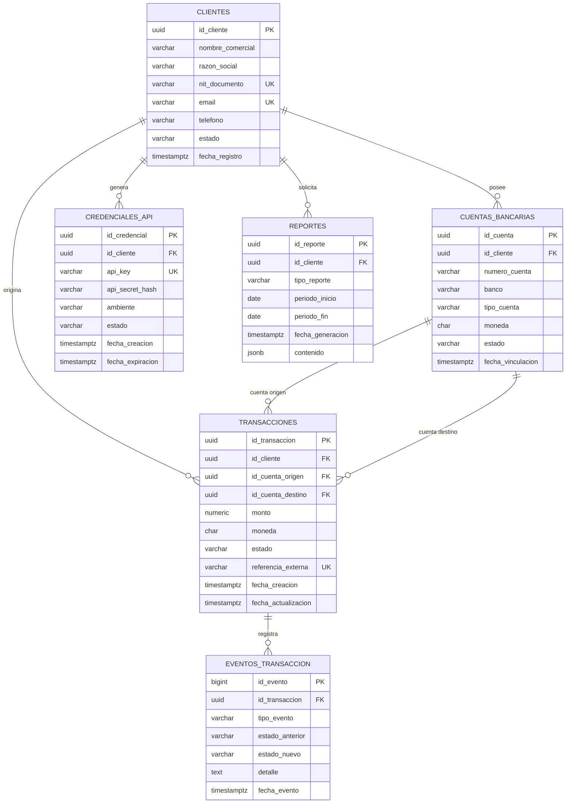

# BD-EAV08-2026-2
Repositorio para entregables propios de la materia de Bases de datos y laboratorios del equipo avanzado 8 de la edición 26-2 de CodeF@ctory, equipo conformado por:

YEPES JARAMILLO ANGEL SIMON: angel.yepes2@udea.edu.co
FORERO AGUDELO CARLOS ALBERTO: carlos.forero@udea.edu.co
ALBORNOZ VILLADIEGO JOSÉ FERNANDO: jose.albornoz@udea.edu.co
CONTRERAS PUELLO SAMUEL ESTEBAN: samuel.contreras@udea.edu.co

#Criterio 1- Entidades y Relaciones
### Diagrama Entidad Relación Mermaid

