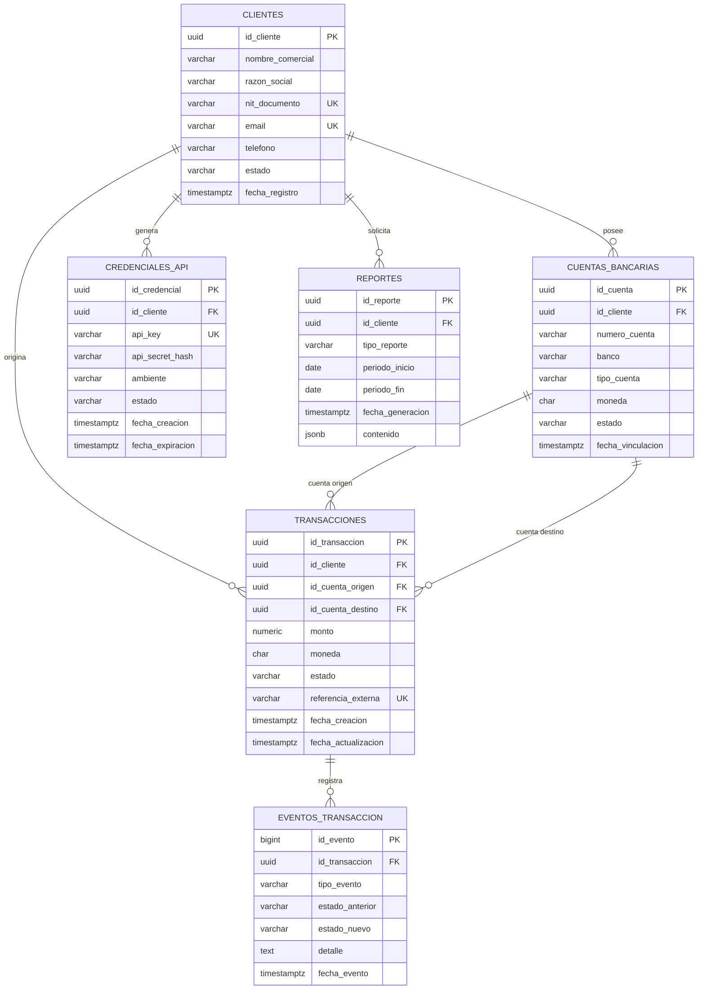

# BD-EAV08-2026-2
Repositorio para entregables propios de la materia de Bases de datos y laboratorios del equipo avanzado 8 de la edición 26-2 de CodeF@ctory, equipo conformado por:

YEPES JARAMILLO ANGEL SIMON: angel.yepes2@udea.edu.co
FORERO AGUDELO CARLOS ALBERTO: carlos.forero@udea.edu.co
ALBORNOZ VILLADIEGO JOSÉ FERNANDO: jose.albornoz@udea.edu.co
CONTRERAS PUELLO SAMUEL ESTEBAN: samuel.contreras@udea.edu.co

# Criterio 1- Entidades y Relaciones

### Entidades

| Entidad | Descripción |
|---|---|
| `clientes` |  Comercios//personas registrados que consumen la plataforma de pagos |
| `cuentas_bancarias` | Cuentas de liquidación de dinero asociadas a un comercio |
| `credenciales_api` | Llaves de acceso (API key/secret) que usa un comercio para autenticarse |
| `transacciones` |  Pagos procesados entre una cuenta origen y una cuenta destino |
| `eventos_transaccion` |  Bitácora de auditoría: cada cambio de estado de una transacción |
| `reportes` |  Reportes de volumen y actividad generados para un comercio |

### Diagrama Entidad Relación Mermaid

### Relaciones y cardinalidad

- Un cliente puede tener una o muchas cuentas bancarias; una cuenta bancaria pertenece a uno y solo un cliente(pasando por alto cuentas de entidades menores como cooperativas donde una cuenta puede tener más de 1 titular). 
- Un cliente puede tener una o muchas credenciales de API; una credencial pertenece a uno y solo un cliente.
- Un cliente puede originar una o muchas transacciones; una transacción es originada por uno y solo un cliente.
- Una cuenta bancaria puede ser origen de cero o muchas transacciones y destino de cero o muchas transacciones. (dos roles distintos de la misma entidad, origen y destino) 
- Una transacción tiene uno o muchos eventos de auditoría; un evento pertenece a una y solo una transacción.
- Un cliente puede tener cero o muchos reportes generados; un reporte pertenece a uno y solo un cliente.

## 2. Preguntas clave de negocio

| # | Pregunta | Tipo de consulta |
|---|---|---|
| 1 | ¿Cuáles son los 10 comercios con mayor volumen de transacciones **aprobadas** en el último mes? | Filtro + agregación |
| 2 | ¿Cuál es el monto total y el número de transacciones por comercio, agrupado por estado (creado/aprobado/rechazado/reembolsado)? | Agregación |
| 3 | ¿Cuál es la tasa de rechazo de transacciones por comercio, en un rango de fechas dado? | Agregación + filtro |
| 4 | ¿Cuál es el historial completo de eventos (cambios de estado) de una transacción específica? | Join |
| 5 | ¿Qué comercios están activos pero no tienen ninguna cuenta bancaria vinculada en estado "activa"? | Filtro + join (antijoin) |

